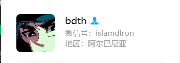
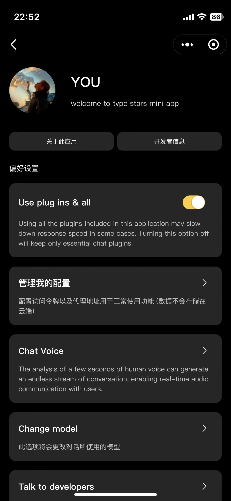

# ts-stats

[](<[https://www.github.com/novicezk/midjourney-proxy](https://github.com/dulaiduwang003/TIME-SEA-PLUS)>)
[](https://www.apache.org/licenses/LICENSE-2.0.html)


### 功能介绍(建议自行体验,以下介绍部分,此项目建议搭配OneApi使用,请务必读完此文档) (项目演示请滑动至最下方)
`自定义GPT模型对话`  `聊天识图` `聊天生图` `语音对话` `文件识别(注意 如果是office 仅支持2007年后的格式 如 docx xlsx ,懒得兼容旧格式)`
### 项目架构

> 小程序端
* [uni-app v3 纯手写组件 不含其他组件库](https://uniapp/)

> 后端

* [SaToken](https://sa-token.cc/)
* [Redis](https://redis.io)
* [Maven](https://maven.io)
* [SpringBoot 3](https://spring.io/projects/spring-boot3)
* [MySQL](https://www.mysql.com)


### 部署环境以及准备工具

`MySQL8`
`Redis7`
`JDK21`
`阿里OSS服务`
`微信小程序APPID以及密钥`


### 小程序根目录执行命令
```shell
    ## 安装开发环境依赖
    npm install
```


### BUG或功能要点更新反馈 进群请教 请加作者微信


### 赞赏作者(开发不易 咖啡❤)


### 图片演示 (仅部分 如需体验请进群体验 或 自行部署)





